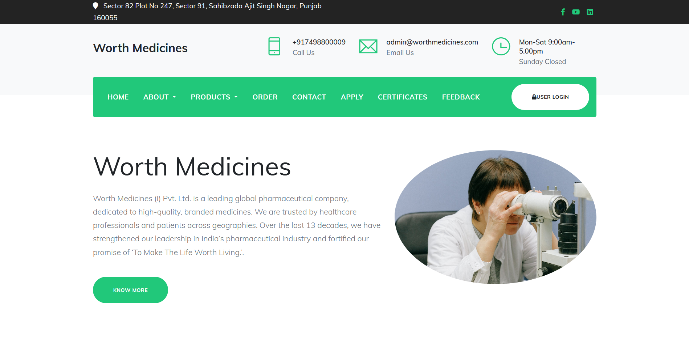
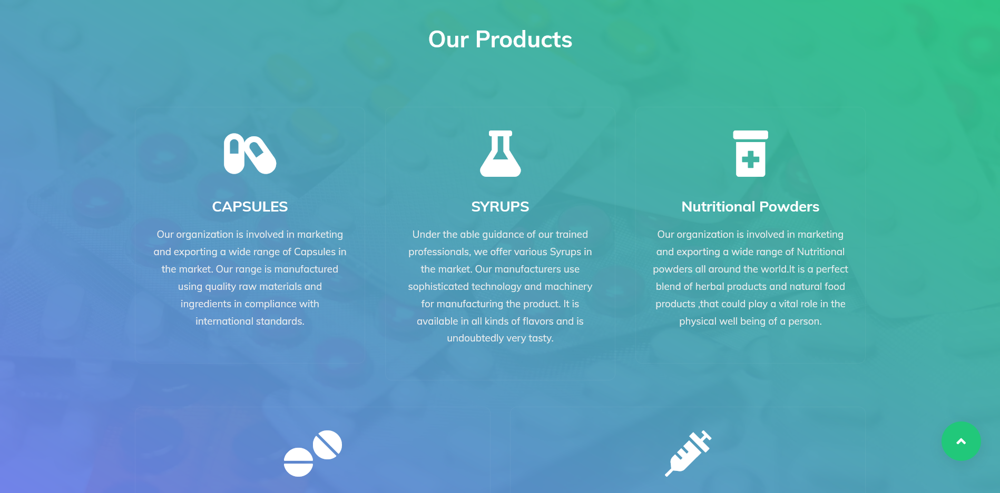
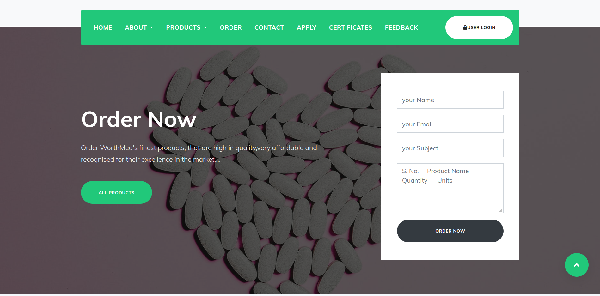

# Worth-Medicines-Project-website-
I recently created a website for a local pharmaceutical company.This is a front-end template developed using simple Html, Css and Bootstrap.Free feel to use it, get ideas or whatever.

## Developed By
> Nishkarsh Dubb

## Screenshots 📷

## Live Demo 

 [https://nishkarsh01.github.io/Worth-Medicines-Project-website-/](https://nishkarsh01.github.io/Worth-Medicines-Project-website-/)

## Developed Using 💻

+ [Html](https://developer.mozilla.org/en-US/docs/Web/HTML)
+ [Css](https://developer.mozilla.org/en-US/docs/Web/CSS)
+ [Bootstrap](https://getbootstrap.com/)
+ [Javascript](https://developer.mozilla.org/en-US/docs/Web/javascript)

## Installation or Getting Started

Run the following command in the terminal:

	git clone https://github.com/Nishkarsh01/Worth-Medicines-Project-website-.git
or download the zip file from github.
    

## Usage
After extracting the files,

    cd Worth-Medicines-Project-website-
    and simply, open the index.html file

## Collaborate
To collaborate, reach me on [nishdubb11@gmail.com]()

## Further help/Reference

+ [MDN Web Docs](https://developer.mozilla.org/en-US/)
+ [getbootstrap.com](https://getbootstrap.com/)
+ [w3schools.com](https://www.w3schools.com/)

    

